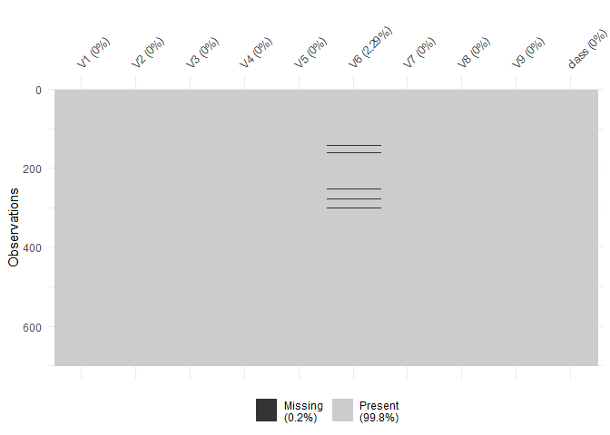
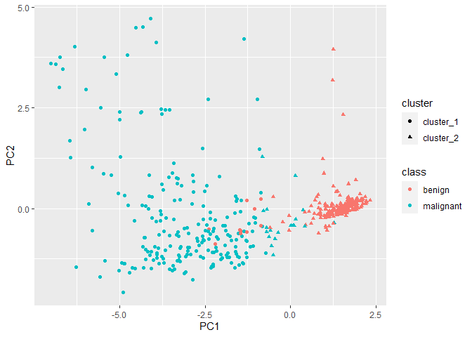
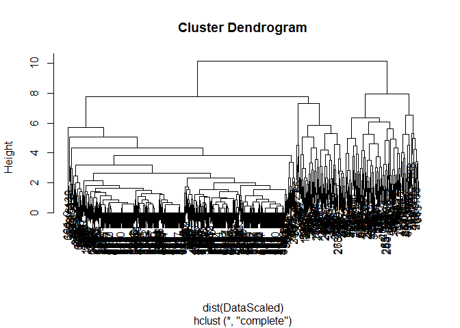
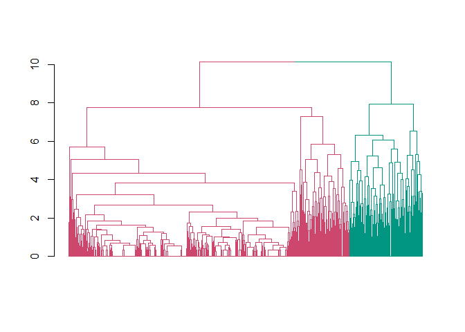
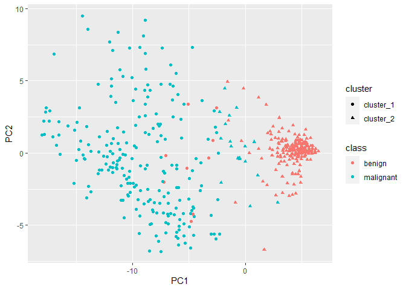

Lab04
================
Shivin Chander
3/24/2021

# Wisconsin breast cancer study

### 3.1

``` r
library(MASS)
library(tidyverse)
library(naniar)
library(dendextend)

suppressPackageStartupMessages(library(dendextend))
```

## Q1: Read in data, are there any missing observations?

``` r
Data <- biopsy
dim(Data)
```

    ## [1] 699  11

``` r
# removing ID column
Data <- dplyr::select(Data, -ID)

# checking for total missing variables
sum(is.na(Data))
```

    ## [1] 16

``` r
# Visualise missingness
vis_miss(Data)
```

<!-- -->

## Q2: Perform case deletion.

``` r
Data <- na.omit(Data)

# Data <- Data[rowSums(is.na(Data))==0,]
```

## Q3: Exclude the class variable and then scale and center the variables.

``` r
# scaling the column
DataScaled <- Data %>%
  dplyr::select(-class) %>%
  scale()
```

## Q4: Perform k-means clustering.

We will show later on in the course (week 7) that we can use dimension
reduction strategies such as principal component analysis (PCA) to
visualise multi-dimensional datasets in two dimensions. Without knowing
how PCA works, you can still hopefully see that this plot shows that
cluster\_1 appears to be capturing signal in the data that is
representative of the malignant group.

``` r
set.seed(51773)
kM <- kmeans(DataScaled,2)

pca <- prcomp(DataScaled)
df <- data.frame(pca$x, cluster = paste("cluster", kM$cluster, sep = "_"), Data)
ggplot(df, aes(x = PC1, y = PC2, colour = class, shape = cluster)) + geom_point()
```

<!-- -->

## Q5: Perform hierarchical clustering with k = 2.

``` r
# clustering on the scaled data
hC <- hclust(dist(DataScaled))

# ploting the dendrogram
plot(hC)
```

<!-- -->

``` r
# cut the dendrogram at a height such that there are two clusters
hCC <- cutree(hC, k = 2)

hC %>% 
  as.dendrogram() %>%
  set("branches_k_color", k = 2) %>% 
  set("labels","") %>%
  plot() 
```

    ## Warning in `labels<-.dendrogram`(dend, value = value, ...): The lengths of the
    ## new labels is shorter than the number of leaves in the dendrogram - labels are
    ## recycled.

<!-- -->

## Q6: Compare clusterings to tumour class. What conclusions could you make and why?

``` r
DATA <- data.frame(Data, kmeans = kM$cluster, hclust = hCC)

(tabk <- table(DATA$kmeans, DATA$class))
```

    ##    
    ##     benign malignant
    ##   1     10       220
    ##   2    434        19

``` r
chisq.test(tabk)
```

    ## 
    ##  Pearson's Chi-squared test with Yates' continuity correction
    ## 
    ## data:  tabk
    ## X-squared = 556.92, df = 1, p-value < 2.2e-16

``` r
(tabh <- table(DATA$hclust, DATA$class))
```

    ##    
    ##     benign malignant
    ##   1    442        99
    ##   2      2       140

``` r
(tabhk <- table(DATA$hclust, DATA$kmeans))
```

    ##    
    ##       1   2
    ##   1  88 453
    ##   2 142   0

## Q7: Do the results change if you do not scale the variables?

``` r
Data2 <- Data %>%
  dplyr::select(-class)

set.seed(51773)
kM2 <- kmeans(Data2,2)
pca2 <- prcomp(Data2)
df2 <- data.frame(pca2$x, cluster = paste("cluster", kM2$cluster, sep = "_"), Data)
ggplot(df2, aes(x = PC1, y = PC2, colour = class, shape = cluster)) + geom_point()
```

<!-- -->
