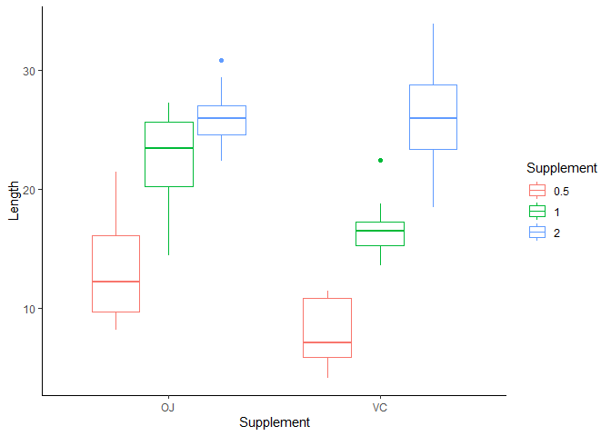
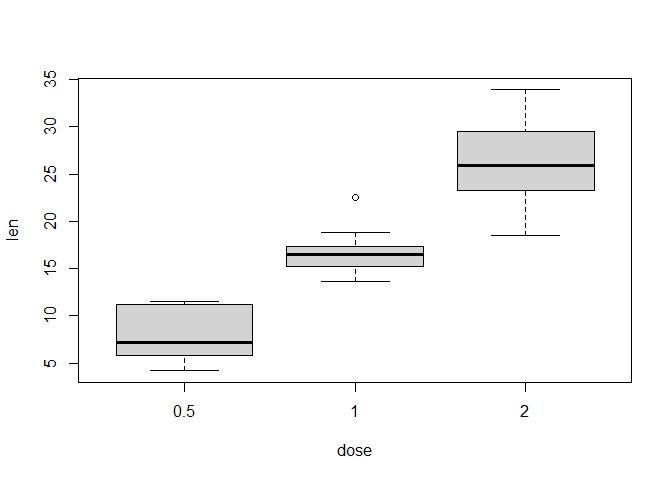
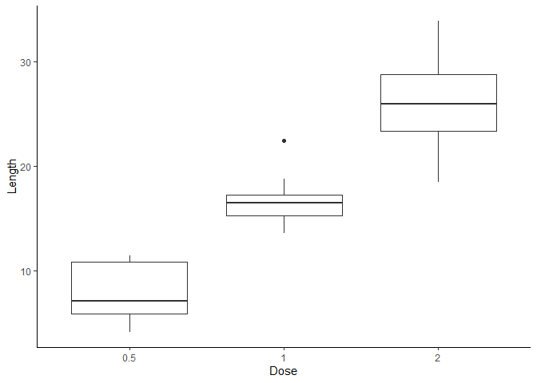
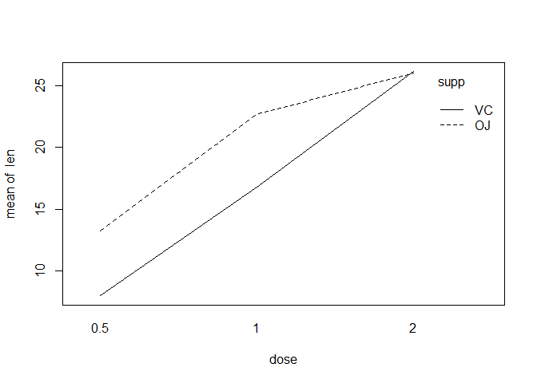
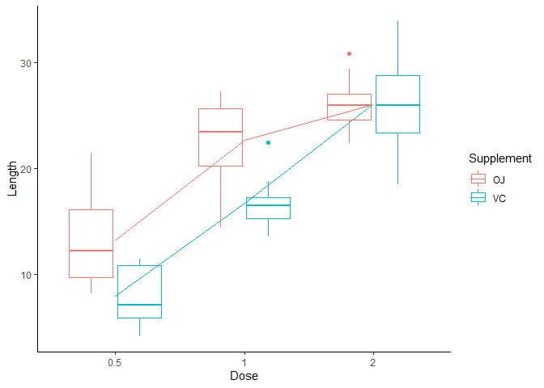

Week 5
================
Shivin Chander
3/31/2021

# 2.1 Tooth Growth Dataset

The data set ToothGrowth.txt has measurements of tooth growth (len) of
guinea pigs for different dosages of Vitamin C (dose) and two different
delivery methods (supp). The response is the length of odontoblasts
(len) in each of 10 guinea pigs at each of three dose levels of Vitamin
C (0.5, 1, and 2 mg) with each of two delivery methods (orange juice or
ascorbic acid). (McNeil, et al, 1977) References: McNeil, D. R. (1977)
Interactive Data Analysis. New York: Wiley. Perform a two-way analysis
of variance of tooth growth modelled by dosage and delivery method. The
following questions help you with this analysis.

``` r
library(ggplot2)
```

    ## Warning: package 'ggplot2' was built under R version 4.0.4

``` r
library(tidyr)
```

    ## Warning: package 'tidyr' was built under R version 4.0.4

``` r
library(datasets)
```

## Q1: Obtain boxplots of the data.

``` r
# toothgrowth is loaded from the 'datasets' package
tooth = ToothGrowth
ggplot(tooth, aes(y = len, x = supp, colour = factor(dose))) + geom_boxplot() + theme_classic() + 
    xlab("Supplement") + ylab("Length") + labs(colour = "Supplement")
```

<!-- -->

## Q2: Consider only Vitamin C supplement, assess the effect of different dose levels. What is the difference between aov1 and aov2 ?

``` r
VCdata = tooth[tooth[, "supp"] == "VC", ]
dim(VCdata)
```

    ## [1] 30  3

``` r
head(VCdata)
```

    ##    len supp dose
    ## 1  4.2   VC  0.5
    ## 2 11.5   VC  0.5
    ## 3  7.3   VC  0.5
    ## 4  5.8   VC  0.5
    ## 5  6.4   VC  0.5
    ## 6 10.0   VC  0.5

``` r
boxplot(len ~ dose, VCdata)
```

<!-- -->

``` r
aov1 = aov(len ~ dose, VCdata)
summary(aov1)
```

    ##             Df Sum Sq Mean Sq F value   Pr(>F)    
    ## dose         1 1601.3  1601.3   117.9 1.51e-11 ***
    ## Residuals   28  380.1    13.6                     
    ## ---
    ## Signif. codes:  0 '***' 0.001 '**' 0.01 '*' 0.05 '.' 0.1 ' ' 1

``` r
aov2 = aov(len ~ factor(dose), VCdata)
summary(aov2)
```

    ##              Df Sum Sq Mean Sq F value   Pr(>F)    
    ## factor(dose)  2   1650   824.7   67.07 3.36e-11 ***
    ## Residuals    27    332    12.3                     
    ## ---
    ## Signif. codes:  0 '***' 0.001 '**' 0.01 '*' 0.05 '.' 0.1 ' ' 1

``` r
ggplot(VCdata, aes(y = len, x = factor(dose))) + geom_boxplot() + theme_classic() + 
    xlab("Dose") + ylab("Length")
```

<!-- -->

``` r
## another way of fitting anova in R
fit = lm(len ~ factor(dose), VCdata)
anova(fit)
```

    ## Analysis of Variance Table
    ## 
    ## Response: len
    ##              Df Sum Sq Mean Sq F value    Pr(>F)    
    ## factor(dose)  2 1649.5  824.74  67.072 3.357e-11 ***
    ## Residuals    27  332.0   12.30                      
    ## ---
    ## Signif. codes:  0 '***' 0.001 '**' 0.01 '*' 0.05 '.' 0.1 ' ' 1

## Q3: Obtain an interaction plot to visualise the interaction between dose and supplement on tooth length and comment on the meaning of the plot. This can be using the function interaction.plot as well as in ggplot.

``` r
# changing dose to factor
tooth$dose = as.factor(tooth$dose)

## interaction.plot function
attach(tooth)
interaction.plot(dose, supp, len)
```

<!-- -->

``` r
detach()

## with ggplot
ggplot(tooth, aes(x = factor(dose), y = len, colour = supp)) + geom_boxplot() + stat_summary(fun.y = mean, 
    geom = "line", aes(group = supp)) + theme_classic() + xlab("Dose") + ylab("Length") + 
    labs(colour = "Supplement")
```

    ## Warning: `fun.y` is deprecated. Use `fun` instead.

<!-- -->

## Q4: Fit the full model including interactions and obtain the corresponding analysis of variance table. Next, use the F-test to compare the full model with the additive model (no interaction model).

``` r
tooth.aov = aov(len ~ supp * dose, tooth)
summary(tooth.aov)
```

    ##             Df Sum Sq Mean Sq F value   Pr(>F)    
    ## supp         1  205.4   205.4  15.572 0.000231 ***
    ## dose         2 2426.4  1213.2  92.000  < 2e-16 ***
    ## supp:dose    2  108.3    54.2   4.107 0.021860 *  
    ## Residuals   54  712.1    13.2                     
    ## ---
    ## Signif. codes:  0 '***' 0.001 '**' 0.01 '*' 0.05 '.' 0.1 ' ' 1

``` r
tooth.aov.additive = aov(len ~ supp + dose, tooth)
summary(tooth.aov.additive)
```

    ##             Df Sum Sq Mean Sq F value   Pr(>F)    
    ## supp         1  205.4   205.4   14.02 0.000429 ***
    ## dose         2 2426.4  1213.2   82.81  < 2e-16 ***
    ## Residuals   56  820.4    14.7                     
    ## ---
    ## Signif. codes:  0 '***' 0.001 '**' 0.01 '*' 0.05 '.' 0.1 ' ' 1

``` r
anova(tooth.aov, tooth.aov.additive)
```

    ## Analysis of Variance Table
    ## 
    ## Model 1: len ~ supp * dose
    ## Model 2: len ~ supp + dose
    ##   Res.Df    RSS Df Sum of Sq     F  Pr(>F)  
    ## 1     54 712.11                             
    ## 2     56 820.43 -2   -108.32 4.107 0.02186 *
    ## ---
    ## Signif. codes:  0 '***' 0.001 '**' 0.01 '*' 0.05 '.' 0.1 ' ' 1
